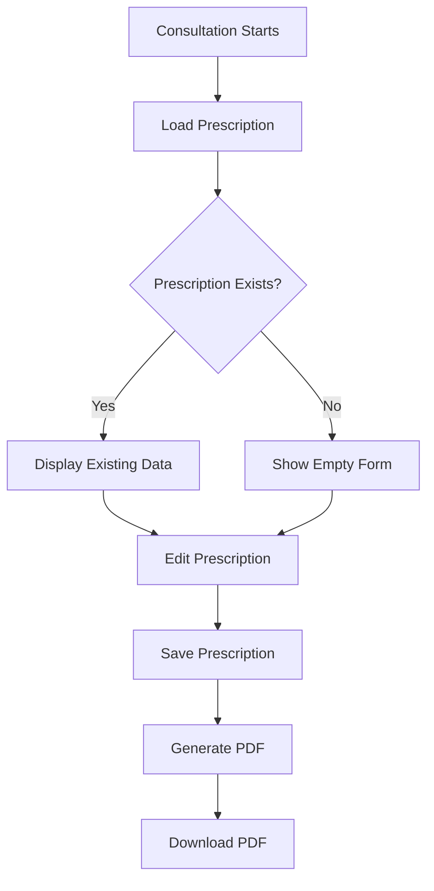

# 🏥 VideoConsultation Component - Prescription API Integration Guide

## Overview

The `VideoConsultation` component has been enhanced to integrate with the existing prescription APIs. This integration allows doctors to create, edit, and generate PDF prescriptions directly during video consultations.

## 🔗 API Integration

### Existing Prescription APIs Used

The component integrates with the following existing prescription APIs:

#### 1. **Get Consultation Prescription**
```typescript
// GET /api/consultations/{consultation_id}/prescription/
prescriptionApi.getConsultationPrescription(consultationId)
```

#### 2. **Create Prescription**
```typescript
// POST /api/prescriptions/
prescriptionApi.createPrescription(prescriptionData)
```

#### 3. **Update Prescription**
```typescript
// PATCH /api/prescriptions/{id}/
prescriptionApi.partialUpdatePrescription(prescriptionId, prescriptionData)
```

#### 4. **Finalize and Generate PDF**
```typescript
// POST /api/prescriptions/{id}/finalize-and-generate-pdf/
prescriptionApi.finalizeAndGeneratePDF(prescriptionId, prescriptionData)
```

## 🚀 Features Implemented

### 1. **Automatic Prescription Loading**
- Loads existing prescription when consultation starts
- Displays current prescription data in the prescription tab
- Shows loading state while fetching data

### 2. **Prescription Creation & Editing**
- Create new prescriptions for consultations
- Edit existing prescriptions with real-time updates
- Save prescriptions as drafts or finalize them

### 3. **Medication Management**
- Add multiple medications to prescriptions
- Configure dosage (morning, afternoon, evening)
- Set special instructions for each medication
- Remove medications as needed

### 4. **PDF Generation**
- Generate professional prescription PDFs
- Automatic download of generated PDFs
- Version control for prescription PDFs

### 5. **Real-time Status Updates**
- Shows prescription status (draft/finalized)
- Loading states for all operations
- Success/error notifications

## 📋 Component Props

```typescript
interface VideoConsultationProps {
  consultationId?: string;  // Required for prescription functionality
  patientId?: string;       // Required for prescription functionality
}
```

## 🎯 Usage Example

```typescript
import VideoConsultation from '@/components/workflow/VideoConsultation';

// In your consultation meeting component
const ConsultationMeeting = () => {
  const consultationId = 'CON068'; // From route params or props
  const patientId = 'PAT12345';    // From route params or props

  return (
    <VideoConsultation 
      consultationId={consultationId}
      patientId={patientId}
    />
  );
};
```

## 🔧 Prescription Tab Features

### **Diagnosis Section**
- Primary diagnosis input field
- General instructions textarea
- Real-time validation and saving

### **Medication Management**
- Add/remove medications
- Configure dosage schedules
- Special instructions per medication
- Medication ordering

### **Action Buttons**
- **Save Prescription**: Saves current prescription data
- **Generate & Download PDF**: Creates and downloads prescription PDF
- **Status Indicators**: Shows if prescription is finalized

## 📊 Data Flow



## 🛠️ API Endpoints Used

### **Backend Endpoints**
1. `GET /api/consultations/{consultation_id}/prescription/`
2. `POST /api/prescriptions/`
3. `PATCH /api/prescriptions/{id}/`
4. `POST /api/prescriptions/{id}/finalize-and-generate-pdf/`

### **Frontend API Functions**
1. `prescriptionApi.getConsultationPrescription()`
2. `prescriptionApi.createPrescription()`
3. `prescriptionApi.partialUpdatePrescription()`
4. `prescriptionApi.finalizeAndGeneratePDF()`

## 🔒 Error Handling

The component includes comprehensive error handling:

- **Network Errors**: Displays user-friendly error messages
- **Validation Errors**: Shows specific field validation errors
- **API Errors**: Handles backend error responses
- **Loading States**: Prevents multiple simultaneous requests

## 📱 User Experience

### **Loading States**
- Spinner animations during API calls
- Disabled buttons during operations
- Progress indicators for PDF generation

### **Success Feedback**
- Toast notifications for successful operations
- Visual status indicators
- Automatic data refresh after operations

### **Error Feedback**
- Clear error messages
- Retry options for failed operations
- Graceful degradation for network issues

## 🎨 UI/UX Enhancements

### **Prescription Tab**
- Clean, organized layout
- Intuitive medication management
- Clear action buttons
- Status badges for prescription state

### **Responsive Design**
- Works on desktop and tablet
- Optimized for consultation workflow
- Accessible form controls

## 🔄 State Management

### **Local State**
- `prescription`: Current prescription data
- `prescriptionData`: Form data being edited
- `isLoadingPrescription`: Loading state
- `isSavingPrescription`: Save operation state
- `isGeneratingPDF`: PDF generation state

### **Data Synchronization**
- Automatic loading on component mount
- Real-time updates during editing
- Synchronized state between form and API

## 🧪 Testing Considerations

### **API Integration Tests**
- Test prescription loading
- Test prescription creation
- Test prescription updates
- Test PDF generation

### **User Flow Tests**
- Test complete prescription workflow
- Test error scenarios
- Test loading states
- Test responsive behavior

## 🚀 Future Enhancements

### **Potential Improvements**
1. **Auto-save**: Implement auto-save functionality
2. **Template Prescriptions**: Pre-defined prescription templates
3. **Medication Database**: Integration with medication database
4. **Digital Signatures**: Add digital signature support
5. **Prescription History**: Show prescription history in consultation

### **Additional Features**
1. **Vital Signs Integration**: Connect with vital signs APIs
2. **Lab Results**: Integration with lab results
3. **Follow-up Scheduling**: Automatic follow-up scheduling
4. **Patient Education**: Educational materials integration

## 📝 Code Structure

### **Key Functions**
- `loadPrescription()`: Loads existing prescription
- `savePrescription()`: Saves prescription data
- `generatePrescriptionPDF()`: Generates and downloads PDF
- `addMedication()`: Adds new medication
- `updateMedication()`: Updates medication data
- `removeMedication()`: Removes medication

### **State Management**
- Uses React hooks for state management
- Proper error boundaries
- Loading state management
- Form validation

## 🔗 Related Components

- `VideoConsultation`: Main consultation component
- `PrescriptionWriter`: Standalone prescription writer
- `PrescriptionManagement`: Prescription management interface

## 📚 Additional Resources

- [Prescription API Documentation](../API_ENDPOINTS_LIST.md)
- [Backend Prescription Models](../../sushrusa_backend/prescriptions/models.py)
- [Prescription API Views](../../sushrusa_backend/prescriptions/views.py)

---

**Note**: This integration uses existing prescription APIs and doesn't create new endpoints. All functionality is built on top of the current prescription system. 